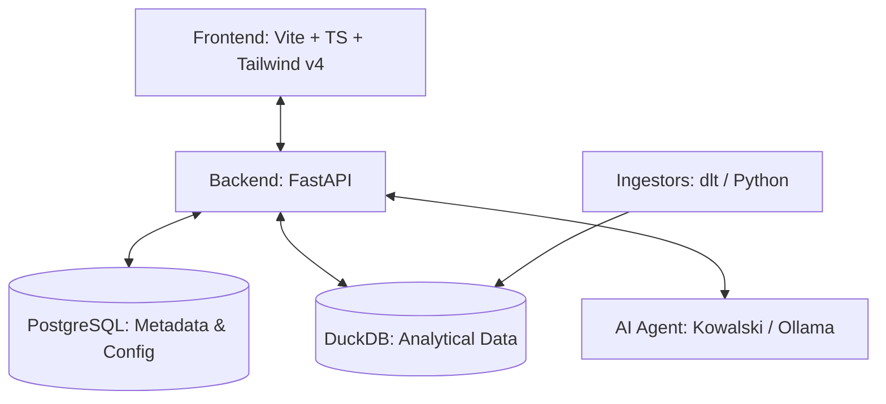

# ravioli 🍝


> AI-Native, Privacy First, Local First, Personal Data Warehouse for "Vibe-Analytics".

**Ravioli** is a modern, open-source personal Data Warehouse (DWH) designed for the AI era. It combines the power of a professional data stack with the casual, interactive feel of a notebook. Part of the **AI Passione** ecosystem.

## 🚀 Vision: Vibe-Analytics for Everyone
Traditional DWHs are stiff and complex. **ravioli** is different. It's built to be:
- **AI-Native**: Ready for integration with LLMs for natural language querying and automated insights.
- **Notebook-Style**: Interactive, iterative, and visual.
- **Business-Friendly**: Designed for people who want results, not just queries.
- **100% Local**: Your data stays on your machine. Privacy by design.
- **Hybrid Architecture**: Fast metadata in Postgres, blazing-fast analytics in DuckDB.

---

## 🛠 Features
- **Seamless Ingestion**: Python-based ingestors for Apple Health, Spotify, LinkedIn, Substack, and more (powered by `dlt`).
- **Kowalski AI Agent**: A clinical, evidence-driven AI persona for high-fidelity data analysis and statistical profiling.
- **Studio Noir UI**: A premium, high-contrast dark-mode interface built with Tailwind CSS v4 and Vite.
- **Knowledge Base**: Manage domain-specific context to ground AI insights in reality.
- **Professional Transformation**: Powered by `dbt` for reliable, version-controlled data modeling.

---

## 🏗 System Architecture



---

## 🚦 Getting Started

### Prerequisites
- [Docker](https://www.docker.com/) & [Docker Compose](https://docs.docker.com/compose/)
- [uv](https://github.com/astral-sh/uv) (Python dependency manager)
- [Node.js](https://nodejs.org/) (for frontend development)

### Launch Everything (Docker)
Spin up the database, AI models, and the interface with a single command:

```bash
docker compose up
```

This will:
1.  Start **PostgreSQL** for metadata.
2.  Launch the **FastAPI** backend at `http://localhost:8000`.
3.  Launch the **Ravioli** frontend at `http://localhost:5173`.

---

## 💻 Development Guide

### Project Structure
```text
ravioli/
├── src/
│   └── ravioli/
│       ├── backend/     # FastAPI application & API logic
│       ├── frontend/    # Vite + Tailwind CSS v4 interface
│       └── ai/          # AI agents & prompt engineering
├── tests/               # Backend & Frontend test suites
├── docker-compose.yml   # Orchestration for local development
└── pyproject.toml       # Python dependencies (managed by uv)
```

### Backend Development
We use `uv` for lightning-fast Python dependency management.

```bash
# Sync environment
uv sync

# Run backend locally (outside Docker)
uvicorn src.ravioli.backend.main:app --reload

# Run tests
pytest
```

### Frontend Development
The frontend is a modern TypeScript application using Tailwind CSS v4.

```bash
cd src/ravioli/frontend
npm install
npm run dev

# Run tests
npm test
```

---

## 🇮🇹 AI Passione Theme
Ravioli is part of the **AI Passione** suite—rebranded from the ground up to bring "passione" back into data engineering. It's about craft, quality, and the joy of discovery.

*Formerly known as Jimwurst.*

